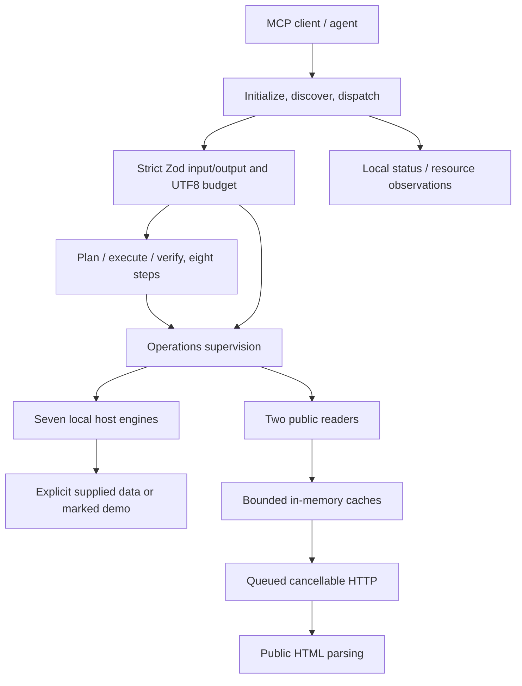

# Architecture

Node24 stdio server with dependency-injected HTTP, parsers, in-memory caches, seven supplied-data host engines, a deterministic workflow orchestrator and a local operations supervisor. Eleven tools are advertised. Logs use stderr.

- [Entry point](../src/index.ts): wiring, CLI, idempotent cleanup and stdin EOF handling.
- [Server](../src/server.ts) and [registry](../src/tools/registry.ts): discovery, request cancellation, contracts, error privacy and256KiB response limit.
- [Host contracts](../src/host-data/contracts.ts) and [engines](../src/host-data): finite ranges, source/completeness metadata and local calculations.
- [Workflow](../src/workflows): full preflight, finite dependency order, deadline, four execution slots, output verification and approval propagation.
- [HTTP](../src/lib/http.ts), [cache](../src/lib/cache.ts) and [parser](../src/parsers/airbnb-public.ts): bounded public reads; unknown facts remain unknown.
- [Operations](../src/operations): recent public health, counters, resource budgets and circuit epochs.

Host metadata is caller asserted. No provider adapter, database, background write, OTEL exporter or LLM is implemented. Workflow arguments/results exist only during the call; logs retain bounded safe metadata. Generic errors never return guest values. Partial workflow results intentionally retain validated domain outputs for client review.

Validation and local queue/quota overload do not establish an upstream outage. Old in-flight success/failure cannot override a newer circuit-recovery epoch. Actual public provider availability remains separate from fixture/host-engine checks.

See [integration](integration.md), [operations](operations.md), [limitations](limitations.md), [acceptance](acceptance-plan.md) and [function inventory](FUNCTIONS.md).
