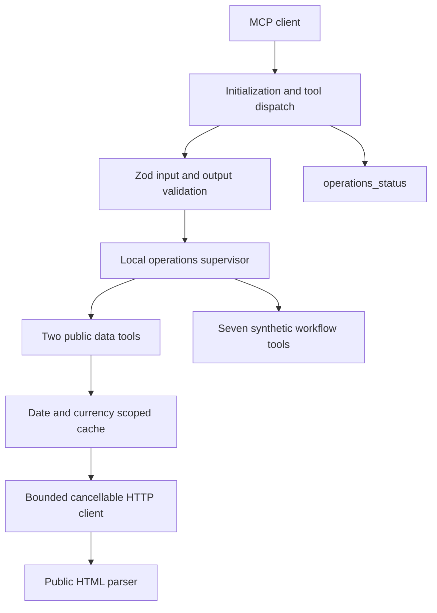

# Architecture

The server runs on Node 24 and connects a standard MCP client over stdio. Logs use stderr. The entry point wires dependency-injected HTTP, in-memory caches, parsers, nine workflow tools, a local operations supervisor and an additional status tool.

- [src/index.ts](../src/index.ts): runtime wiring, CLI and shutdown.
- [src/server.ts](../src/server.ts): tool discovery and MCP dispatch, including cancellation context.
- [src/tools/registry.ts](../src/tools/registry.ts): generated JSON schemas, input/output validation and error envelopes.
- [src/lib/http.ts](../src/lib/http.ts): deadlines, bounded queue/body, throttling, Retry-After, cancellation and cleanup.
- [src/parsers/airbnb-public.ts](../src/parsers/airbnb-public.ts): defensive parsing of modern and legacy public HTML.
- [src/mocks](../src/mocks): deterministic synthetic workflow fixtures.
- [src/operations](../src/operations): process-local counters and recovery rules.

Valid results are returned as JSON text and structured content. Errors set isError and contain a bounded diagnostic text envelope. Validation failures do not count as an upstream outage. Unknown tools produce an MCP protocol error.

Public prices preserve their evidence: a stay total is never presented as a nightly rate; missing prices, currency and unavailable numeric facts remain null. Mock workflows include _mock markers, approval requirements and uncertainty where applicable.

Telemetry records timing and error kinds. Debug mode stores bounded structural summaries, numeric metadata and explicit safe enums; arbitrary strings and dynamic keys are redacted. The supervisor retains counters and fixed error kinds, without guest content. There is no persistent database or implemented OTEL exporter.

See [operations](operations.md), [integration](integration.md), [limitations](limitations.md) and [the generated index](INDEX.md) for the rest of the system.
